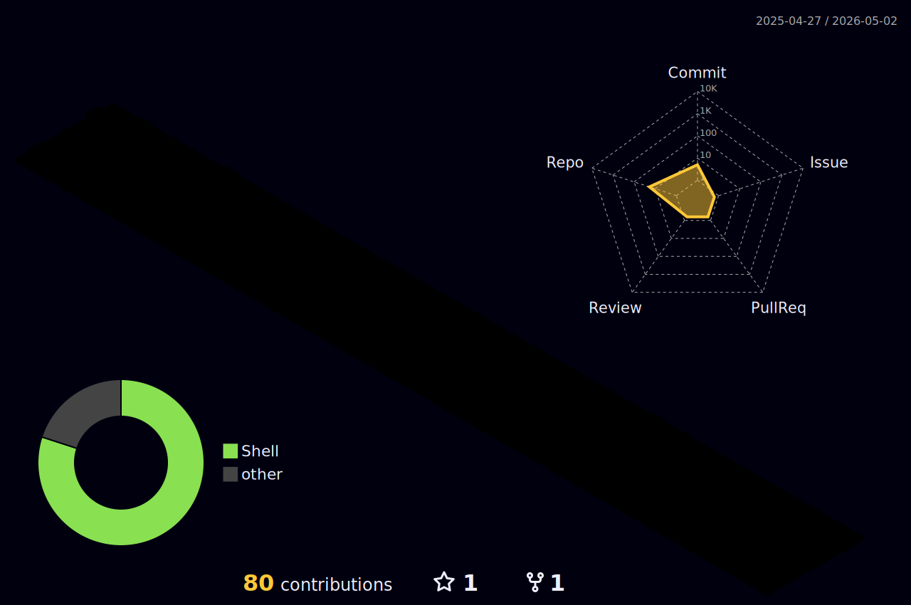

# 

<h1 align="center">Hi 👋, I'm C0mpi11er</h1>
<h3 align="center">🎮 Unreal Engine ⚙️ & C++ Architect | 🛡️ Cybersecurity Engineer & Pentester</h3>

  

  

  

- 🔭 I’m currently working on **Pangaea Kingdom** — a Web3 MMORPG blending African mythology and blockchain

- 🌱 Currently diving deeper into **🗼Gameplay Ability System**, advanced multiplayer, and server architecture

- 🤝 Open to collaborations on **game development, AI systems, and red-team cybersecurity operations**

- 🛠️ **Expertise:** Unreal Engine (C++ & Blueprints), GAS, EQS, Behavior Trees, Multiplayer, Server Rewind, Procedural Gen

- 🧠 Offensive security enthusiast: WAF bypassing, C2 frameworks, privilege escalation, network & web app pentesting

- 👨‍💻 Explore my work on [Itch.io](https://c0mpi11er.itch.io)

- 💬 Ask me anything about: `Unreal Engine`, `C++`, `GAS`, `Linux`, `OffSec`, `Reverse Engineering`, `Blender`, `Networking`

- 📫 Reach me: **c0mpi11er47@gmail.com**

- ⚡ Fun fact: **I know how to exit Vim** 😉

---

## 🔐 Cybersecurity Craft

- 🔍 **Offensive Security Specialist**
  - Red Teaming | Web Exploitation | Network Attacks | Linux/Windows PE
  - Skilled in bypassing AWS/Azure/Cloudflare WAFs
  - Expert in XSS, SQLi, SSRF, LFI/RFI, Command Injection, etc.

- 🛠️ **Toolkit**
  - `Burp Suite`, `Nmap`, `ffuf`, `Gobuster`, `Metasploit`, `Impacket`, `PowerView`, `BloodHound`, `Responder`, `SQLmap`
  - Scripting: Bash, Python, PowerShell, C/C++ (for exploit dev)

- 🎖️ **Achievements**
  - [TryHackMe Jr PenTester](https://tryhackme.com)
  - Multiple top-tier Red Team badges

---

## 🎮 Game Dev Arsenal

- 💡 **Gameplay Systems Engineering**
  - Advanced GAS architecture: effects, tags, replication, stat scaling
  - Server-side rewind, hit confirmation, latency mitigation
  - Multiplayer lobby & session management, dedicated servers

- 🧠 **AI & Behavior Trees**
  - Dynamic EQS-based target selection & reactionary behavior
  - Enemy archetypes with vision cones, sound perception, tactical pathing

- 🎭 **Animation Systems**
  - Motion Matching, Root Motion, custom blendspaces
  - Stylized ragdoll transitions, synced trail/VFX, attack montage chaining

- 🧰 **Tooling + UX**
  - Modular UMG UI for ability wheels, skill trees, quest tracking, inventory
  - In-editor debugging tools for AI visualization & gameplay tweaking

- 🌍 **Notable Projects**
  - 🧿 **Pangaea Kingdom** — AAA Web3 MMORPG built with Unreal Engine GAS, procedural world gen, and NFT integrations
  - 🦠 **COVID9** — Multiplayer zombie shooter with wave AI, traps, and survival mechanics
  - 🧮 **Math Adventures** — Educational 3D game for kids, real-time arithmetic combat and animations

---

## 🌐 Let's Connect

---

## 🧰 Tools & Tech

  
  
  
  
  
  
  
  

---

&nbsp;

---

  

> 🧠 "Cybersecurity protects the future. Game dev imagines it."
