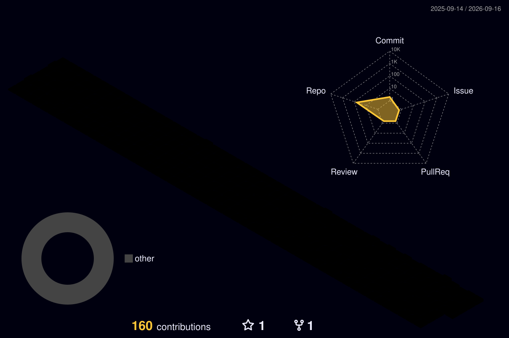

# 

  

<h1 align="center">C̷0̶M̴P̶I̶1̷1̵E̸R̴</h1>

<h1 align="center">
  
</h1>

<pre align="center">
┌──(root@c0mpi11er)-[~]
└─# sudo ./black_hat.sh --red-team --unreal --oscp

[sudo] password for c0mpi11er: ********
[+] CLEARANCE :: RED TEAM LEAD
[+] DOMAIN    :: OFFENSIVE SECURITY // UNREAL ENGINE ARCHITECTURE
[+] STATUS    :: OSCP PREP // EXPLOIT DEV // SERVER AUTHORITY
[+] ETHICS    :: AUTHORIZED ADVERSARY EMULATION ONLY
[ACCESS GRANTED]
</pre>

  
  
  

<h1 align="center">💀 Hi 👋, I'm C0mpi11er 💀</h1>
<h3 align="center">🎮 Unreal Engine ⚙️ & C++ Architect | 🛡️ Red Team Lead & Pentester</h3>
<h4 align="center">☠️ Black-hat aesthetic. Professional red-team execution. ⚠️</h4>

  
  
  
  
  

  
  

  

  

- 🔭 Currently leading **Red Team operations** while architecting **Pangaea Kingdom** — a Web3 MMORPG blending African mythology, blockchain, and Unreal Engine systems.

- 🧠 Not junior anymore. I operate as a **Red Team Lead** and senior-level **Unreal Engine / C++ systems architect**.

- 🎯 Currently sharpening for **OSCP** while running adversary emulation, exploit development, and offensive research.

- 🏴 Finished / cleared: **CPTS on Hack The Box**, **PortSwigger Web Security Academy**, and **TryHackMe** offensive paths.

- 🦾 Low-level focus: **Assembly**, **C**, **C++**, **PowerShell**, **JavaScript**, **PHP**, and **SQL** for exploit dev, tooling, and offensive research.

- 🎮 Game dev: Unreal Engine C++/Blueprints, GAS, EQS, Behavior Trees, multiplayer, server rewind, procedural generation, and engine-level systems design.

- 🛡️ Offensive security: WAF bypassing, C2 frameworks, privilege escalation, Active Directory attacks, web app pentesting, and network exploitation.

- 👨‍💻 Explore my work on [Itch.io](https://c0mpi11er.itch.io)

- 💬 Ask me anything about: `Unreal Engine`, `C++`, `GAS`, `Linux`, `OffSec`, `Reverse Engineering`, `Blender`, `Networking`, `Exploit Dev`

- 📫 Reach me: **c0mpi11er47@gmail.com**

- ⚡ Fun fact: **I know how to exit Vim... and then kill the process that tried to trap me.** 😉💀

 

---

  
  

📁 CLASSIFIED // RED_TEAM_DOSSIER

 

> FILE: `C0MPI11ER_RED_TEAM.enc`  
> CLEARANCE: `BLACK`  
> STATUS: `ACTIVE`

- Operator: **C0mpi11er**
- Role: **Red Team Lead**
- Objective: **Authorized adversary emulation**
- Specialization: **Web, Network, AD, Privilege Escalation, Exploit Dev**
- Languages: `Assembly`, `C`, `C++`, `PowerShell`, `JavaScript`, `PHP`, `SQL`
- Current Mission: **OSCP preparation**
- Redacted Operation: `██████████`
- Redacted Payload: `██████████`

📁 CLASSIFIED // EXPLOIT_LOG

 

<pre align="center">
[+] Target acquired
[+] WAF fingerprint detected
[+] Bypass chain assembled
[+] Privilege escalation path mapped
[+] Access persisted
[LOG] Operation closed. No traces left.
</pre>

---

## ☠️ Red Team Command

| Position | Focus | Current Objective |
|---|---|---|
| **Red Team Lead** | Adversary emulation, offensive tooling, exploit research | Leading authorized red team operations |
| **OSCP Candidate** | Penetration testing methodology, privilege escalation, post-exploitation | Preparing for OSCP |
| **Engine Architect** | Unreal Engine C++, GAS, multiplayer, server authority | Building Pangaea Kingdom |

  
  
  
  

> 🩸 I don't just find vulnerabilities. I turn them into leverage.

---

## 🎓 Hacker Certifications & Battle Proofs

| Certification / Platform | Status | Focus |
|---|---|---|
| **OSCP** | Candidate | Offensive security, privilege escalation, post-exploitation |
| **CPTS** | Completed | Hack The Box penetration testing specialist track |
| **PortSwigger Web Security Academy** | Completed | Web exploitation, SSRF, SQLi, XSS, deserialization, auth bypass |
| **TryHackMe** | Completed | Offensive security paths, privilege escalation, enumeration |
| **Red Team Operations** | Active | Adversary emulation, offensive tooling, attack path validation |

---

## 🔐 Cybersecurity Craft

- 🔍 **Offensive Security Specialist**
  - Red Teaming | Web Exploitation | Network Attacks | Linux/Windows PE | Active Directory
  - Skilled in bypassing AWS/Azure/Cloudflare WAFs
  - Expert in XSS, SQLi, SSRF, LFI/RFI, Command Injection, Deserialization, Auth bypass, and chained exploitation

- 🦾 **Exploit Development & Low-Level Attacks**
  - Assembly-aware shellcode analysis
  - Memory corruption fundamentals
  - Reverse engineering and debugging
  - Weaponizing `C`, `C++`, `PowerShell`, `JavaScript`, `PHP`, and `SQL` for offensive tooling

- 🛠️ **Toolkit**
  - `Burp Suite`, `Nmap`, `ffuf`, `Gobuster`, `Metasploit`, `Impacket`, `PowerView`, `BloodHound`, `Responder`, `SQLmap`
  - Scripting / exploit dev: `Bash`, `Python`, `PowerShell`, `C`, `C++`, `JavaScript`, `Assembly`, `PHP`, `SQL`

- 🎖️ **Achievements**
  - Multiple top-tier Red Team badges
  - Completed PortSwigger Web Security Academy labs
  - Completed TryHackMe offensive paths
  - Earned / completed CPTS-related Hack The Box work
  - Currently preparing for OSCP

---

📁 CLASSIFIED // ENGINE_ARCHITECTURE

 

> FILE: `UNREAL_ENGINE_CORE.sys`  
> ACCESS: `LEAD_ARCHITECT`  
> MODE: `SERVER_AUTHORITY`

- 🎮 Unreal Engine C++ / Blueprint architecture
- ⚙️ Gameplay Ability System replication and prediction
- 🌐 Server-authoritative multiplayer design
- 🧠 Behavior Trees, EQS, tactical AI, perception systems
- 🧱 Procedural generation and scalable world systems
- 🛡️ Anti-cheat-aware validation and server-side logic

---

## 🎮 Game Dev Arsenal

- 💡 **Gameplay Systems Engineering**
  - Advanced GAS architecture: effects, tags, replication, stat scaling
  - Server-side rewind, hit confirmation, latency mitigation
  - Multiplayer lobby & session management, dedicated servers
  - Server-authoritative gameplay design
  - Anti-cheat-aware architecture and validation logic

- 🧠 **AI & Behavior Trees**
  - Dynamic EQS-based target selection & reactionary behavior
  - Enemy archetypes with vision cones, sound perception, tactical pathing
  - Combat AI designed around pressure, flanking, and adaptation

- 🎭 **Animation Systems**
  - Motion Matching, Root Motion, custom blendspaces
  - Stylized ragdoll transitions, synced trail/VFX, attack montage chaining
  - Responsive combat feel through animation + networking coordination

- 🧰 **Tooling + UX**
  - Modular UMG UI for ability wheels, skill trees, quest tracking, inventory
  - In-editor debugging tools for AI visualization & gameplay tweaking
  - Internal tooling for faster iteration, testing, and combat balancing

- 🌍 **Notable Projects**
  - 🧿 **Pangaea Kingdom** — AAA Web3 MMORPG built with Unreal Engine GAS, procedural world gen, and NFT integrations
  - 🦠 **COVID9** — Multiplayer zombie shooter with wave AI, traps, and survival mechanics
  - 🧮 **Math Adventures** — Educational 3D game for kids, real-time arithmetic combat and animations

---

## 🌐 Let's Connect

  
  
  

---

## 🧰 Tools & Tech

### Core Icons

  
  
  
  
  
  
  
  
  
  
  
  
  

### Black Hat Arsenal Badges

  
  
  
  
  
  
  
  
  
  
  
  

---

## 📊 GitHub Telemetry

  <table>
    <tr>
      <td>
        
      </td>
      <td>
        
      </td>
    </tr>
  </table>

  

---

---

  

---

## 🐍 Contribution Snake

  

---

  

> 🧠 "Cybersecurity protects the future. Game dev imagines it. I break both to make them stronger."

  

